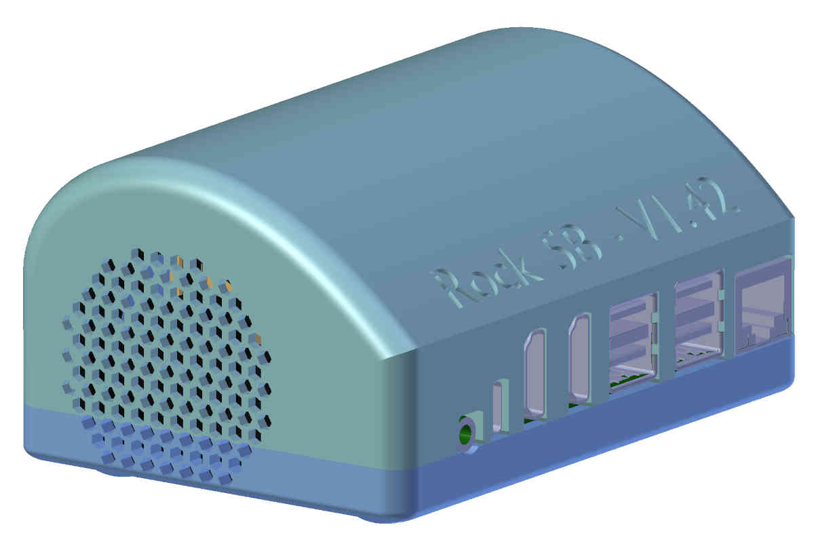
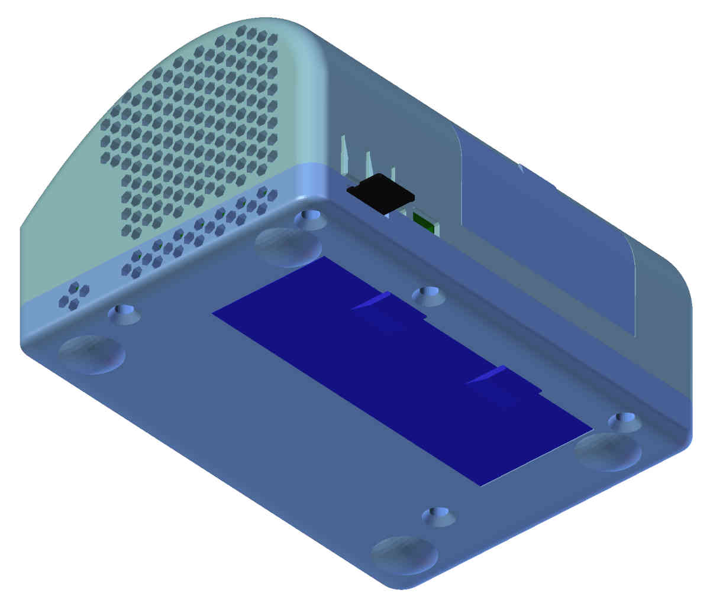
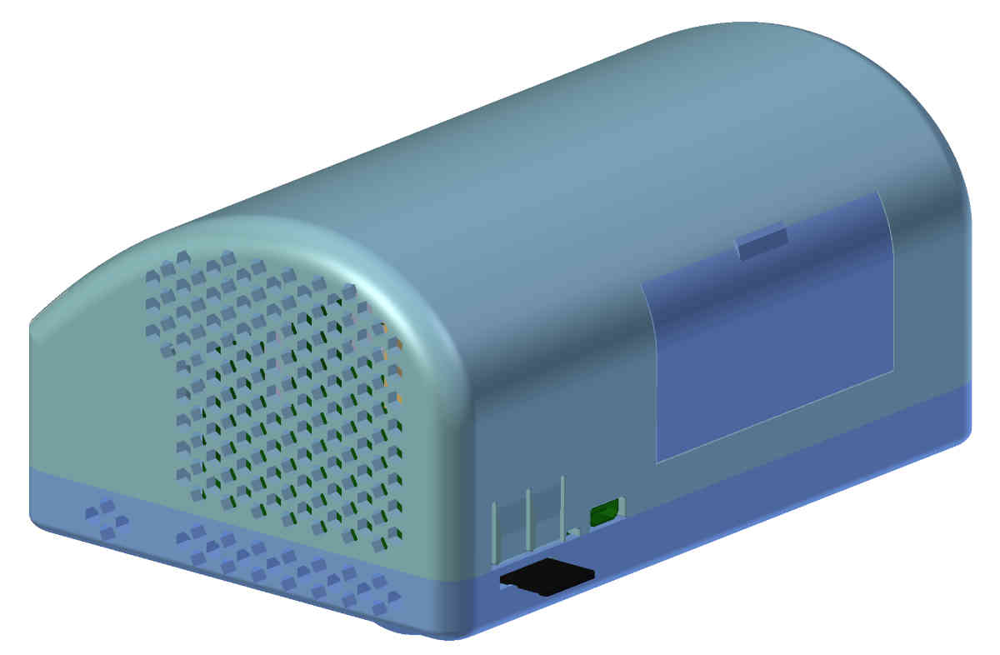
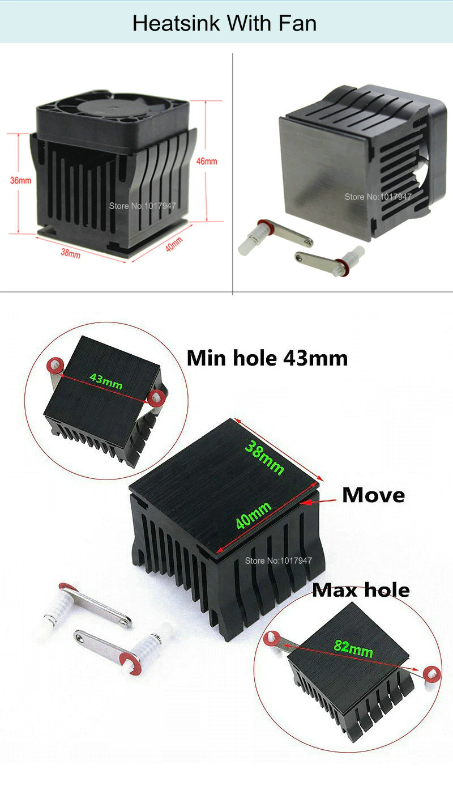

# Rock5B_Sideblower_Case
A printable case for rockpi 5B with sideblowing fan

It has removable covers for NVMe and GPIO-connector.
It is designed for a 40x40x10 Fan (like Sunon EE40100S2-1000U)
and as enuf room for Heatsink that is mountable in any direction (as [Northbridge Heatsink from STC Cooling/Aliexpress](https://de.aliexpress.com/item/32432346031.html) ). I bought it without fan and bought a silent Sunon fan.

